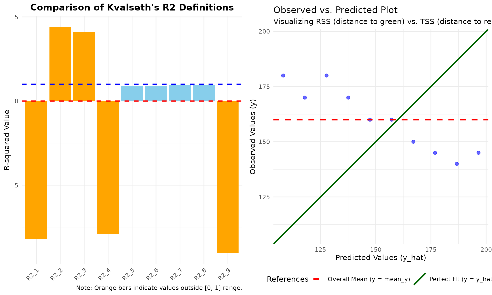
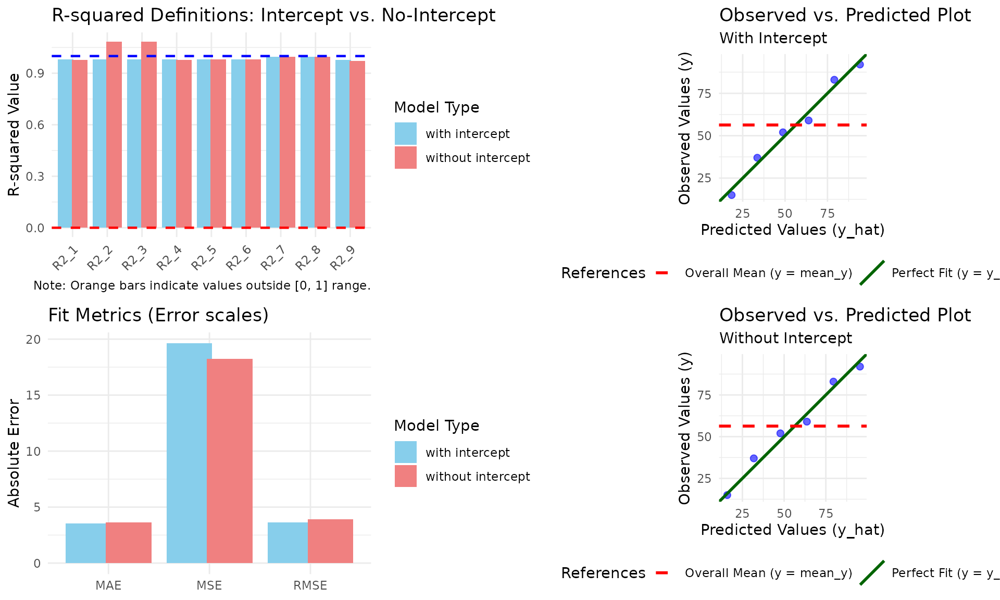
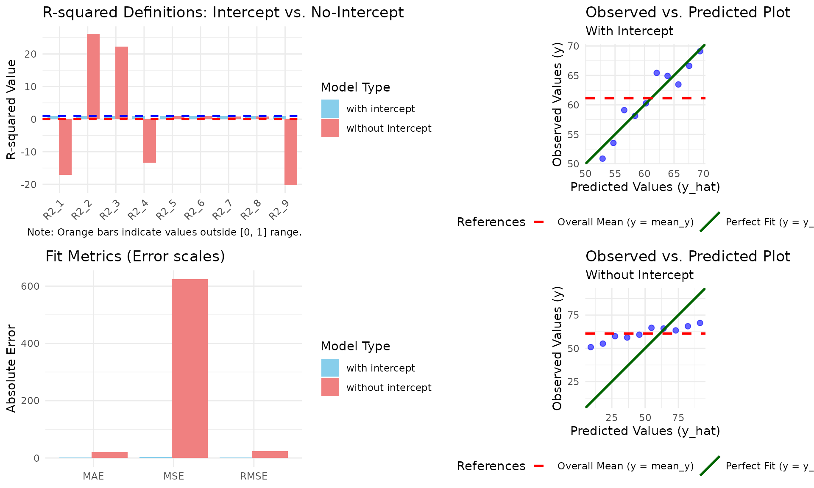

# The Pitfalls of R-squared: Understanding Mathematical Sensitivity

## Introduction: Why \\R^2\\ is Not Unique

In many statistical software packages, the coefficient of determination
(\\R^2\\) is presented as a singular, definitive value. However, as
Tarald O. Kvalseth pointed out in his seminal 1985 paper, “Cautionary
Note about \\R^2\\”, there are multiple ways to define and calculate
this metric.

While these definitions converge in standard linear regression with an
intercept, they can diverge dramatically in other contexts, such as
models without an intercept or power regression models. The `kvr2`
package is designed as an educational tool to explore this
**mathematical sensitivity**.

## The Eight + One Definitions

Kvalseth (1985) classified eight existing formulas and proposed one
robust alternative. Here are the core definitions used in this package:

### Standard Definitions

- \\R^2_1\\: The most common form, measuring the proportion of variance
  explained. Kvalseth strongly recommends this for consistency.

\\R_1^2 = 1 - \frac{\sum(y - \hat{y})^2}{\sum(y - \bar{y})^2}\\

- \\R^2_2\\: Often used in some contexts, but can exceed 1.0 in
  no-intercept models.

\\R_2^2 = \frac{\sum(\hat{y} - \bar{y})^2}{\sum(y - \bar{y})^2}\\

- \\R^2_6\\: The square of Pearson’s correlation coefficient between
  observed and predicted values.

\\R_6^2 = \frac{\left( \sum(y - \bar{y})(\hat{y} - \bar{\hat{y}})
\right)^2}{\sum(y - \bar{y})^2 \sum(\hat{y} - \bar{\hat{y}})^2}\\

### Definitions for No-Intercept Models

- \\R^2_7\\: Specifically designed for models passing through the
  origin.

\\R_7^2 = 1 - \frac{\sum(y - \hat{y})^2}{\sum y^2}\\

### Robust Definition

- \\R^2_9\\: Proposed by Kvalseth to resist the influence of outliers by
  using medians (\\M\\).

\\R_9^2 = 1 - \left( \frac{M\\\|y_i - \hat{y}\_i\|\\}{M\\\|y_i -
\bar{y}\|\\} \right)^2\\

------------------------------------------------------------------------

## When \\R^2\\ Goes Negative: Interpretation and Risks

One of the most confusing moments for a researcher is encountering a
negative . Mathematically, is often expected to be between 0 and 1.
However, in several formulas—most notably —the value can become
negative.

### Meaning of Negative Values

A negative indicates that the chosen model predicts the data **worse
than a horizontal line representing the mean of the observed data**.

In , this occurs when the Residual Sum of Squares (RSS) exceeds the
Total Sum of Squares (TSS). This is a clear signal that:

- The model is fundamentally inappropriate for the data.
- You are forcing a model through a specific constraint (like a
  zero-intercept) that the data strongly resists.

### Case Study: Forcing a No-Intercept Model

Consider a dataset with a strong negative trend where we force the model
through the origin.

``` r
library(kvr2)

# Example: Data with a trend that doesn't pass through (0,0)
df_neg <- data.frame(
  x = c(110, 120, 130, 140, 150, 160, 170, 180, 190, 200),
  y = c(180, 170, 180, 170, 160, 160, 150, 145, 140, 145)
)

model_forced <- lm(y ~ x - 1, data = df_neg)
r2(model_forced)
#> R2_1 :  -8.2183 
#> R2_2 :  4.3883 
#> R2_3 :  4.0856 
#> R2_4 :  -7.9156 
#> R2_5 :  0.8976 
#> R2_6 :  0.8976 
#> R2_7 :  0.9303 
#> R2_8 :  0.9303 
#> R2_9 :  -9.0197 
#> ---------------------------------
#> (Type: linear, without intercept, n: 10, k: 1)
```

In this case, is approximately -15.2. This massive negative value tells
us that using the mean of as a predictor would be far more accurate than
this zero-intercept model. Interestingly, \\R^2_6\\ and \\R^2_8\\ remain
positive because they measure correlation or re-fit the intercept,
potentially masking how poor the original forced model actually is.

## The Transformation Trap (Power Models)

In power regression models (typically fitted via log-log
transformation), the definition of the “mean” and “residuals” becomes
ambiguous. Does the \\R^2\\ refer to the transformed space or the
original space?

When `type = "auto"` (the default), `kvr2` detects whether the model is
a power regression by analyzing the model formula. It specifically looks
for the [`log()`](https://rdrr.io/r/base/Log.html) function call on the
dependent variable.

``` r
# Power model via log-transformation
df1 <- data.frame(x = 1:6, y = c(15, 37, 52, 59, 83, 92))
model_power <- lm(log(y) ~ log(x), data = df1)
r2(model_power)
#> R2_1 :  0.9777 
#> R2_2 :  1.0984 
#> R2_3 :  1.0983 
#> R2_4 :  0.9778 
#> R2_5 :  0.9816 
#> R2_6 :  0.9811 
#> R2_7 :  0.9961 
#> R2_8 :  1.0232 
#> R2_9 :  0.9706 
#> ---------------------------------
#> (Type: power, with intercept, n: 6, k: 2)
```

## Distinguishing Variable Names from Functions

Unlike simpler string-matching approaches, `kvr2` distinguishes between
a variable actually named “log” and the logarithmic function. This
prevents misclassification when you have a linear model where a variable
is named “log”.

``` r
# A linear model where the dependent variable is named 'log'
df_log_name <- data.frame(x = 1:6, log = c(15, 37, 52, 59, 83, 92))
model_linear_log <- lm(log ~ x, data = df_log_name)

# kvr2 correctly identifies this as "linear", not "power"
model_info(r2(model_linear_log))$type
#> [1] "linear"
```

## Transparency and Metadata: Beyond the Numbers

When comparing nine different definitions of \\R^2\\, it is crucial to
know the exact parameters used in the calculation. The `kvr2` package
ensures transparency by storing and displaying the model metadata.

### Inspecting Model Information

The
[`model_info()`](https://indenkun.github.io/kvr2/reference/model_info.md)
function allows you to retrieve the underlying specifications of the
calculation:

``` r
model_no_int <- lm(y ~ x - 1, df1)
res <- r2(model_no_int)
model_info(res)
#> $type
#> [1] "linear"
#> 
#> $has_intercept
#> [1] FALSE
#> 
#> $n
#> [1] 6
#> 
#> $k
#> [1] 1
#> 
#> $df_res
#> [1] 5
```

This returns:

- **type**: Whether the calculation treated the model as linear or
  power.
- **has_intercept**: Verification of the intercept’s presence.
- **n**: The actual sample size used (excluding any missing values).
- **k**: The number of parameters (important for adjusted \\R^2\\).
- **df_res**: Residual degrees of freedom (\\n - k\\).

### Enhanced Console Output

By default, the print method for `r2_kvr2` and `comp_kvr2` objects now
displays this information at the bottom. This feature serves as a
built-in “sanity check” to ensure you are comparing like with like. If
you only need the numerical results, you can disable this using
print(results, `model_info = FALSE`).

------------------------------------------------------------------------

## Technical Note: How R Calculates

It is important to understand how the standard R function
[`summary.lm()`](https://rdrr.io/r/stats/summary.lm.html) computes its
reported . Internally, R uses the ratio of sums of squares:

Where is the Model Sum of Squares and is the Residual Sum of Squares.

### The Shift in Baseline

- **With Intercept**: is calculated relative to the mean. In this case,
  , and the formula is equivalent to .
- **Without Intercept**: R changes the definition of to the sum of
  squares about the origin.

Because R shifts the baseline for no-intercept models, the reported by
`summary(lm(y ~ x - 1))` can appear high even if the model is poor. The
`kvr2` package helps expose this by showing (relative to the mean)
alongside R’s default behavior, allowing you to see if your model is
truly better than a simple average.

------------------------------------------------------------------------

## Case Study: The Danger of No-Intercept Models

Let’s use the example data from Kvalseth (1985) to see how these values
diverge when we remove the intercept.

``` r
df1 <- data.frame(x = 1:6, y = c(15, 37, 52, 59, 83, 92))

# Model without an intercept
model_no_int <- lm(y ~ x - 1, data = df1)

# Calculate all 9 types
results <- r2(model_no_int)
results
#> R2_1 :  0.9777 
#> R2_2 :  1.0836 
#> R2_3 :  1.0830 
#> R2_4 :  0.9783 
#> R2_5 :  0.9808 
#> R2_6 :  0.9808 
#> R2_7 :  0.9961 
#> R2_8 :  0.9961 
#> R2_9 :  0.9717 
#> ---------------------------------
#> (Type: linear, without intercept, n: 6, k: 1)
```

### The Trap

Notice that \\R^2_2\\ and \\R^2_3\\ are greater than 1.0. This happens
because, without an intercept, the standard sum of squares relationship
(\\SS\_{tot} = SS\_{reg} + SS\_{res}\\) no longer holds. If a researcher
blindly reports \\R^2_2\\, the result is mathematically nonsensical.

Kvalseth argues that \\R^2_1\\ is generally preferable because it
remains bounded by 1.0 and maintains a clear interpretation of “error
reduction.”

------------------------------------------------------------------------

## Visualizing the Sensitivity of R-squared

To better understand the divergence between these definitions, the
`kvr2` package provides a specialized plotting function. When you apply
[`plot_kvr2()`](https://indenkun.github.io/kvr2/reference/plot_kvr2.md)
to your model, it displays both the comparison of \\R^2\\ definitions
and a diagnostic observed-vs-predicted plot.

``` r
# Example with the forced no-intercept model
plot_kvr2(model_forced)
```



The diagnostic plot (right panel) provides an immediate visual
explanation for anomalous \\R^2\\ values.

As you can see, when the data points are clustered closer to the **red
dashed line (mean)** than the **green solid line (model prediction)**,
it mathematically forces \\R^2_1\\ to become negative. This is because
\\R^2_1\\ is defined as:

\\R_1^2 = 1 - \frac{RSS}{TSS}\\

Where: - **RSS** (Residual Sum of Squares) is the distance to the green
line. - **TSS** (Total Sum of Squares) is the distance to the red line.

When the green line is a poorer fit than the red line, \\RSS \> TSS\\,
resulting in \\R^2_1 \< 0\\.

Similarly, in no-intercept models, some definitions like \\R^2_2\\ can
exceed 1.0 because the standard decomposition \\SS\_{tot} = SS\_{reg} +
SS\_{res}\\ no longer applies. The plot reveals this instability by
showing how the model’s trajectory (green line) deviates from the actual
trend of the data points.

------------------------------------------------------------------------

## Comparing Intercept vs. No-Intercept Models

One of the most critical insights from Kvalseth (1985) is that certain
\\R^2\\ definitions become unreliable—or even mathematically
invalid—when a model is forced through the origin (no-intercept
model).To facilitate this comparison, the kvr2 package provides the
comp_model() function. This tool automatically fits both the intercept
and no-intercept versions of your model and aligns their metrics
side-by-side.

### Practical Example: The Sensitivity of \\R^2\\

Consider a scenario where we force a linear model through the origin. We
can use the df1 dataset from Kvalseth’s original paper:

``` r
model_int <- lm(y ~ x, data = df1)

# Compare the two model specifications
comparison <- comp_model(model_int)
```

#### 1. The Inflation of \\R^2_2\\

Notice that in the **without intercept** row, **R2_2** exceeds 1.0
(e.g., 1.0836). This occurs because \\R^2_2\\ is defined as \\\sum
\hat{y}^2 / \sum (y - \bar{y})^2\\ in some contexts, and without an
intercept, the standard sum-of-squares decomposition breaks down. This
serves as a visual warning that \\R^2_2\\ is an inappropriate measure
for no-intercept models.

#### 2. The Drop in Predictive Accuracy

While some \\R^2\\ values might appear higher in the no-intercept model,
the **RMSE** (Root Mean Squared Error) typically increases. This
indicates that the “forced” model actually has poorer predictive
performance, even if certain \\R^2\\ definitions suggest otherwise.

#### Adjusted R-squared Comparison

You can also compare degree-of-freedom adjusted values by setting
`adjusted = TRUE`. This is particularly useful when comparing models
with different numbers of predictors, though in the intercept
vs. no-intercept case, it primarily highlights the penalty for removing
the intercept term.

``` r
# Compare adjusted R-squared values
comp_model(model_int, adjusted = TRUE)
#> model             | R2_1_adj | R2_2_adj | R2_3_adj | R2_4_adj | R2_5_adj
#> ------------------------------------------------------------------------
#> with intercept    |   0.9760 |   0.9760 |   0.9760 |   0.9760 |   0.9760
#> without intercept |   0.9732 |   1.1003 |   1.0996 |   0.9739 |   0.9770
#> 
#> model             | R2_6_adj | R2_7_adj | R2_8_adj | R2_9_adj |   RMSE |    MAE |     MSE
#> -----------------------------------------------------------------------------------------
#> with intercept    |   0.9760 |   0.9958 |   0.9958 |   0.9722 | 3.6165 | 3.5238 | 19.6190
#> without intercept |   0.9770 |   0.9953 |   0.9953 |   0.9661 | 3.9008 | 3.6520 | 18.2593
#> ---------------------------------
#> 
#> Note: Some R2 values exceed 1.0 or are negative, indicating that these definitions may be inappropriate for the no-intercept model.
```

### Visualizing the Comparison: The Diagnostic Dashboard

To truly understand why \\R^2\\ values fluctuate or become inappropriate
when the intercept is removed, numerical tables are often not enough.
The `kvr2` package provides a specialized
[`plot()`](https://rdrr.io/r/graphics/plot.default.html) method for
`comp_model` objects that generates a comprehensive **2x2 diagnostic
dashboard**.

By simply calling
[`plot()`](https://rdrr.io/r/graphics/plot.default.html) on the
comparison results, you can simultaneously inspect the statistical
shifts and the underlying data distribution.

``` r
# Generate the 2x2 comparison dashboard
plot(comparison)
```



#### Key Features of the Dashboard:

- **Left Column (Metrics)**: Shows the 9 types of \\R^2\\ and the fit
  metrics (RMSE/MAE/MSE) side-by-side for both models. Orange bars
  immediately highlight “illegal” \\R^2\\ values (outside the \\\[0,
  1\]\\ range) in the no-intercept model.
- **Right Column (Diagnostics)**: Provides Observed-vs-Predicted plots
  for both specifications. This allows you to visually confirm how the
  regression line “forces” itself through the origin in the no-intercept
  model, often leading to a poorer fit compared to the horizontal mean
  line (the red dashed line).

This visual approach is essential for educational purposes, as it
demonstrates the “cause and effect” between model constraints and
statistical outcomes.

------------------------------------------------------------------------

### Example: When \\R^2\\ Breaks (The Importance of Visuals)

To illustrate why we need nine different definitions and a diagnostic
plot, let’s look at a dataset where the relationship between \\x\\ and
\\y\\ is strong, but the regression line does not pass near the origin.
When we force the model through \\(0,0)\\ by removing the intercept,
several \\R^2\\ definitions will produce misleading or even impossible
values (outside the \\\[0, 1\]\\ range).

``` r
# Create a dataset where y = 50 + 2x + noise
set.seed(123)
df_break <- data.frame(x = 1:10, y = 50 + 2 * (1:10) + rnorm(10, 0, 2))

# Compare models
res_break <- comp_model(lm(y ~ x, data = df_break))

# The numerical output will show R2_2 and R2_3 > 1.0
res_break
#> model             |     R2_1 |    R2_2 |    R2_3 |     R2_4 |   R2_5 |   R2_6
#> -----------------------------------------------------------------------------
#> with intercept    |   0.9011 |  0.9011 |  0.9011 |   0.9011 | 0.9011 | 0.9011
#> without intercept | -17.1930 | 26.1535 | 22.2762 | -13.3157 | 0.9011 | 0.9011
#> 
#> model             |   R2_7 |   R2_8 |     R2_9 |    RMSE |     MAE |      MSE
#> -----------------------------------------------------------------------------
#> with intercept    | 0.9992 | 0.9992 |   0.9252 |  1.7473 |  1.3934 |   3.8165
#> without intercept | 0.8511 | 0.8511 | -20.2905 | 23.6965 | 20.3954 | 623.9158
#> ---------------------------------
#> 
#> Note: Some R2 values exceed 1.0 or are negative, indicating that these definitions may be inappropriate for the no-intercept model.
```

By plotting this comparison, we can see exactly **why** the statistics
fail:

``` r
plot(res_break)
```



In the **Bottom-Right** panel (Without Intercept), the green “Perfect
Fit” line is forced to go through the origin, causing it to stay far
away from all data points. This distance is much larger than the
distance to the red “Mean” line. Consequently, the Residual Sum of
Squares (RSS) exceeds the Total Sum of Squares (TSS), leading to a
negative \\R^2_1\\. Simultaneously, other definitions like \\R^2_2\\
overstate the fit because they use a different baseline that doesn’t
account for this forced displacement.

------------------------------------------------------------------------

### A Note on Plot Customization

Unlike standard `ggplot2` objects, the output of `plot(comp_model_obj)`
**cannot** be modified using the `+` operator (e.g., `+ theme_bw()`).

This is because the function uses the `grid` system to arrange four
independent plots into a single dashboard. Internally, the function
returns the input object `x` **invisibly** after drawing the grid.

If you need to customize the individual plots, we recommend using the
standalone plotting functions:

- Use `plot_kvr2(model, plot_type = "r2")` to get a single, customizable
  `ggplot` object for \\R^2\\ comparison.
- Use `plot_diagnostic(model)` to get a single, customizable `ggplot`
  object for the observed-vs-predicted view.

------------------------------------------------------------------------

## Conclusion: A Multi-Metric Approach

As demonstrated, a single value can be misleading. When is negative or
exceeds, it is a diagnostic signal. We recommend:

1.  **Compare \\R^2_1\\ and \\R^2\_{reported}\\**: If they differ
    wildly, your intercept constraint is likely problematic.
2.  **Check Absolute Errors**: Always look at RMSE or MAE alongside
    \\R^2\\ to understand the actual scale of the prediction error.
3.  **Verify the Calculation Context**: Use
    [`model_info()`](https://indenkun.github.io/kvr2/reference/model_info.md)
    to ensure that the sample size (\\n\\) and model type (linear
    vs. power) match your expectations across different model
    comparisons.
4.  **Context Matters**: Use \\R^2_7\\ for legitimate origin-constrained
    physical models, but be wary of its tendency to inflate the
    perception of fit.

## References

Kvalseth, T. O. (1985) Cautionary Note about \\R^2\\. The American
Statistician, 39(4), 279-285. [DOI:
10.1080/00031305.1985.10479448](https://doi.org/10.1080/00031305.1985.10479448)

Yutaka Iguchi. (2025) Differences in the Coefficient of Determination
\\R^2\\: Using Excel, OpenOffice, LibreOffice, and the statistical
analysis software R. Authorea. December 23, [DOI:
10.22541/au.176650719.94164489/v1](https://doi.org/10.22541/au.176650719.94164489/v1)
